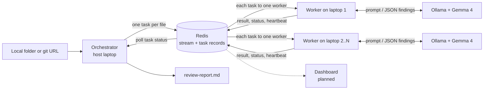

# LapClusters

> Turn the laptops your team already owns into a private AI cluster that reviews a whole code repository in parallel, with no cloud bill and no code leaving the room.

**Status:** the backend is built (checkpoints 1 to 3 of 5). A repository can be reviewed end to end, several laptops share the work, and a worker that dies mid-job has its task taken over. It has been run across two laptops on a phone hotspot. The dashboard and a proper benchmark are still to come and are marked as planned below.

## Team

**Team Name:** [Team Name]


| Member | Contribution   |
| ------ | -------------- |
| [Name] | [Contribution] |
| [Name] | [Contribution] |
| [Name] | [Contribution] |
| [Name] | [Contribution] |


## Problem Statement

### The Problem

Small teams and students want to use AI on their own code, but cloud AI costs money per request and means sending private code to someone else's servers. A single laptop running a local model is private and free, but slow: reviewing a whole repository file by file can take a very long time.

### Why We Chose This Problem

[Explain why the team selected this problem and why solving it is important.]

## Solution

LapClusters pools a team's laptops into one private cluster. Every laptop runs its own copy of Gemma 4, and a shared Redis queue hands out work. For a code review, the orchestrator creates one task per file, the laptops review files in parallel, and the results are merged into a single report.

### Key Features

Built:

- A shared task queue on Redis Streams that delivers each task to exactly one worker.
- A worker that answers queued prompts with Gemma 4 running locally through Ollama.
- Per-task status tracking (`pending`, `running`, `done`, `failed`) with the result or error stored alongside.
- A worker that survives bad tasks, model errors and a dropped Redis connection.
- Whole-repository code review from a local folder or a git URL: one task per source file, merged into one Markdown report sorted by severity.
- Structured model output: Gemma 4 is constrained to a JSON schema, with one retry if a reply is still unusable.
- Worker heartbeats, and automatic takeover of a task whose worker has died. A task abandoned three times is marked failed so a job always finishes.
- Automatic host discovery on the local network: workers find the host without an IP address being typed, and follow it if its address changes.
- A command-line tool that submits a single prompt and waits for the answer.

Planned:

- A run across all four laptops.
- A live dashboard showing connected laptops and task progress.
- A benchmark comparing one laptop against the full cluster.

## Innovation and Differentiation

Existing tools for pooling machines, such as exo, Petals and llama.cpp's RPC mode, split one large model across devices. LapClusters does the opposite: each laptop runs a complete small model, and the cluster distributes independent tasks between them. That keeps every laptop useful on its own, tolerates a laptop leaving mid-job, and needs nothing more than a network connection to Redis.

Work is split by a fixed rule (one task per file) and not by asking the model to plan, because small models are reliable at narrow tasks and unreliable at decomposing large ones.

## Technical Implementation

### Architecture



Solid lines are built. The dotted line is planned.

### Technology Stack


| Category        | Technologies                                             |
| --------------- | -------------------------------------------------------- |
| Frontend        | N/A (dashboard page planned)                             |
| Backend         | Python 3.11+, redis-py, httpx, python-dotenv             |
| Database        | Redis 7 (Streams, consumer groups, hashes, sets)         |
| AI / ML         | Gemma 4 E4B (`gemma4:e4b`) served locally by Ollama      |
| Infrastructure  | Docker (runs Redis), Git (clones repositories), pytest   |
| APIs / Services | Ollama local HTTP API. No cloud services                 |


If a category or technology is not implemented in the project, specify `N/A` instead of leaving the field blank.

### How It Works

- `lapclusters/taskqueue.py` is the only module that talks to Redis. Adding a task writes a status record (`task:{id}`), registers the task under its job (`job:{id}`) and appends it to the `tasks` stream, all in one transaction.
- `lapclusters/repo.py` turns a folder or git URL into a list of source files. A URL is cloned into a temporary folder on the host laptop, which is deleted once the files are read. Dependency folders, non-source files and files over 20 KB are left out.
- `lapclusters/orchestrator.py` queues one review task per file, with the file's content inside the task, waits for all of them, and writes the report.
- `lapclusters/review.py` builds the review prompt (with numbered lines) and cleans up the model's JSON reply.
- `lapclusters/worker.py` runs a loop: claim one task through the `workers` consumer group, run it on the model, store the result, acknowledge the task. A background thread refreshes the worker's heartbeat every 5 seconds.
- `lapclusters/discovery.py` and `lapclusters/host.py` let workers find the host. The host answers a UDP broadcast question with its name and Redis port; the Redis password is never sent over the network this way.
- `lapclusters/llm.py` makes the HTTP call to Ollama on the same laptop.
- `lapclusters/cli.py` adds one plain-prompt task and polls its status record until it is `done` or `failed`.
- `lapclusters/config.py` reads the Redis address, Ollama address, model name and worker name from environment variables or a `.env` file.

### Technical Decisions

- **Redis Streams with a consumer group** instead of a plain list, because the group guarantees one worker per task and keeps a record of tasks that were claimed but never finished.
- **Workers pull work when free.** Nothing assigns tasks up front, so a faster laptop naturally takes more.
- **Task content travels through Redis.** Workers need only a Redis connection, not a copy of the repository or internet access.
- **Failures are recorded, not raised.** A model error or malformed task marks that task `failed` and the worker carries on.
- **Takeover is based on heartbeats, not elapsed time.** A task is only taken from a worker whose heartbeat has expired, so a slow laptop that is still working is never interrupted.
- **The model's output is constrained to a JSON schema** through Ollama's structured output, because free-text replies from a small model are not reliably parseable.
- **The Redis read timeout (60 s) is set above the worker's wait (5 s).** The client library's default timeout equals the wait, which made an idle worker crash.
- **Model context raised to 8192 tokens**, because Ollama's 4096 default is too small for source files.

## Implementation During the Hackathon

[Describe what the team built during the Hack Day and the major functionality or components completed during the event.]

### Team Contributions

- **[Member Name]:** [Contribution]
- **[Member Name]:** [Contribution]
- **[Member Name]:** [Contribution]
- **[Member Name]:** [Contribution]

## Working Application

**Live Application:** N/A. LapClusters runs on your own laptops by design, so there is no hosted version.

See "Setup and Usage" below to run it locally.

The submitted application should be functional and accessible through the provided link where applicable.

## Demo Video

**Demo Video:** [Video URL]

[Provide a short demonstration of the working project, covering the main user flow and important functionality.]

## Open Source and AI Usage

### AI / Models

- **Gemma 4 E4B (Google, open weights):** the only model in the system. Every worker sends its task's prompt to a local copy and stores the reply. No request leaves the laptop.

### Open Source Components

- **Ollama:** runs Gemma 4 locally and exposes it over HTTP.
- **Redis:** task queue and status store.
- **redis-py:** Python client for Redis.
- **httpx:** HTTP client used to call Ollama.
- **python-dotenv:** loads settings from a `.env` file.
- **pytest:** test runner.
- **Docker:** runs the Redis server.

No datasets or external APIs are used.

## Setup and Usage

### Prerequisites

- Python 3.11 or newer
- Docker Desktop (to run Redis)
- Ollama with the `gemma4:e4b` model pulled

A fuller install guide for teammates is in [docs/SETUP.md](docs/SETUP.md).

### Installation

```bash
git clone https://github.com/VishnuVardhanNk/LapCluster.git
cd LapCluster
python -m venv .venv
.venv\Scripts\Activate.ps1
python -m pip install -r requirements.txt
docker run -d --name redis -p 6379:6379 redis:7
ollama pull gemma4:e4b
```

On macOS or Linux, activate the environment with `source .venv/bin/activate`.

### Environment Variables

Copy `.env.example` to `.env` and adjust if needed. Every value has a working default for a single laptop.

```env
REDIS_URL=redis://localhost:6379/0
OLLAMA_URL=http://localhost:11434
MODEL=gemma4:e4b
WORKER_NAME=
MODEL_TIMEOUT_S=600
```

### Running the Project

Start a worker:

```bash
python -m lapclusters.worker
```

### Usage

In a second terminal, review a repository. The source can be a local folder or a git URL:

```bash
python -m lapclusters.orchestrator tests/fixtures/sample_repo
```

Progress is printed as files finish, and the report is written to `review-report.md` (change it with `--output`). The bundled sample repository contains deliberate bugs to try it on. The first request is slower because Ollama has to load the model.

To send a single prompt instead:

```bash
python -m lapclusters.cli "Explain what a task queue is in one sentence."
```

### Adding More Laptops

One laptop is the host: it runs Redis and the orchestrator. Every laptop, including the host, runs a worker and its own Ollama.

1. On the host, start Redis with a password, and allow inbound TCP port 6379 and UDP port 47600 through its firewall.
2. On the host, run `python -m lapclusters.host` and leave it open. It announces the cluster on the local network.
3. On every other laptop, install the project and pull the model, then put this in `.env`: `REDIS_URL=redis://:PASSWORD@auto:6379/0`. The word `auto` tells the worker to find the host by itself.
4. Start `python -m lapclusters.worker` on each laptop. It prints the host address it found.
5. Run the orchestrator on the host. It prints how many workers are live.

Nobody types an IP address, and if the host's address changes a worker finds it again within a few seconds. `python -m lapclusters.discovery` lists the hosts visible from a laptop. If the network blocks broadcasts, put the host's IP address in place of `auto`.

If several hosts are on the same network, the worker lists them and asks which one to join, then stays with that host for the rest of the session. To skip the question, name the host in `.env` with `CLUSTER_HOST=`.

Only the host needs the repository and internet access. Step-by-step commands are in [docs/SETUP.md](docs/SETUP.md).

Run the tests (Redis must be running):

```bash
python -m pytest
```

To watch tasks move through Redis, and for what each teammate builds next, see [docs/TEAM_GUIDE.md](docs/TEAM_GUIDE.md).

### Known Limitations

- Run across two laptops so far, not yet four.
- Automatic discovery needs a network that allows broadcasts between devices, such as a phone hotspot. Some campus and office networks do not.
- Automatic discovery trusts whoever answers. On a network you do not control, another device could pose as a host and receive the Redis password a worker sends it, so use a fixed address or a private network such as Tailscale there.
- Source files over 20 KB are listed as not reviewed, because they do not fit in the model's context.
- Each file is reviewed in isolation, so problems that span several files are not found.
- The model sometimes reports problems that are not real. Treat the report as leads to check.
- A dead worker's task is taken over by the next worker that becomes free, so the handover can take as long as that worker's current file.

## Devpost Submission

**Devpost Project:** [Devpost Project URL]

[Add the link to the team's Devpost submission. Ensure the Devpost project page is complete and contains the required project information, links, media, and team details.]

## Credits and License

### Credits

- Gemma 4 by Google.
- Ollama, Redis, redis-py, httpx, python-dotenv, pytest and Docker, each under its own licence.
- Repository template by the Hacktoberfest Hack Day Coimbatore 2026 organisers (INIT Club and iDEA Club, with Major League Hacking).

### License

Apache License 2.0 is intended. The `LICENSE` file has not been added yet.

## Submission Checklist

- [x] Project title and description added
- [ ] All team members listed
- [x] Problem clearly explained
- [ ] Reason for choosing the problem explained
- [x] Solution and key features documented
- [x] Innovation and differentiation explained
- [x] Architecture included
- [x] Technical implementation documented
- [ ] Work completed during the hackathon documented
- [ ] Team contributions documented
- [ ] Working application is functional
- [ ] Live application link added where applicable
- [ ] Demo video added
- [x] AI and open-source components documented
- [ ] Setup and usage instructions tested
- [ ] Challenges and learnings documented
- [ ] Devpost submission completed
- [ ] Devpost link added
- [x] Credits added
- [ ] License added
- [ ] Repository is organized and complete
