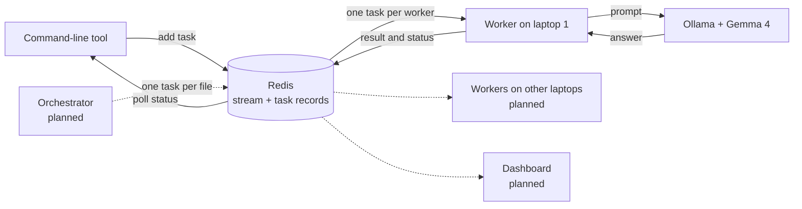

# LapClusters

> Turn the laptops your team already owns into a private AI cluster that reviews a whole code repository in parallel, with no cloud bill and no code leaving the room.

**Status:** checkpoint 1 of 5 is built. One worker answers prompts sent through the shared queue. Repository review, multi-laptop operation and the dashboard are planned and are marked as such below.

## Team

**Team Name:** [Team Name]


| Member | Contribution   |
| ------ | -------------- |
| [Name] | [Contribution] |
| [Name] | [Contribution] |
| [Name] | [Contribution] |
| [Name] | [Contribution] |


## Problem Statement

### The Problem

Small teams and students want to use AI on their own code, but cloud AI costs money per request and means sending private code to someone else's servers. A single laptop running a local model is private and free, but slow: reviewing a whole repository file by file can take a very long time.

### Why We Chose This Problem

[Explain why the team selected this problem and why solving it is important.]

## Solution

LapClusters pools a team's laptops into one private cluster. Every laptop runs its own copy of Gemma 4, and a shared Redis queue hands out work. For a code review, the orchestrator creates one task per file, the laptops review files in parallel, and the results are merged into a single report.

### Key Features

Built:

- A shared task queue on Redis Streams that delivers each task to exactly one worker.
- A worker that answers queued prompts with Gemma 4 running locally through Ollama.
- Per-task status tracking (`pending`, `running`, `done`, `failed`) with the result or error stored alongside.
- A worker that survives bad tasks, model errors and a dropped Redis connection.
- A command-line tool that submits a prompt and waits for the answer.

Planned:

- Whole-repository code review: one task per file, merged into one report.
- Workers on several laptops, with stalled tasks reassigned when a laptop drops out.
- A live dashboard showing connected laptops and task progress.
- A benchmark comparing one laptop against the full cluster.

## Innovation and Differentiation

Existing tools for pooling machines, such as exo, Petals and llama.cpp's RPC mode, split one large model across devices. LapClusters does the opposite: each laptop runs a complete small model, and the cluster distributes independent tasks between them. That keeps every laptop useful on its own, tolerates a laptop leaving mid-job, and needs nothing more than a network connection to Redis.

Work is split by a fixed rule (one task per file) and not by asking the model to plan, because small models are reliable at narrow tasks and unreliable at decomposing large ones.

## Technical Implementation

### Architecture



Solid lines are built. Dotted lines are planned.

### Technology Stack


| Category        | Technologies                                             |
| --------------- | -------------------------------------------------------- |
| Frontend        | N/A (dashboard page planned)                             |
| Backend         | Python 3.11+, redis-py, httpx, python-dotenv             |
| Database        | Redis 7 (Streams, consumer groups, hashes, sets)         |
| AI / ML         | Gemma 4 E4B (`gemma4:e4b`) served locally by Ollama      |
| Infrastructure  | Docker (runs Redis), pytest                              |
| APIs / Services | Ollama local HTTP API. No cloud services                 |


If a category or technology is not implemented in the project, specify `N/A` instead of leaving the field blank.

### How It Works

- `lapclusters/taskqueue.py` is the only module that talks to Redis. Adding a task writes a status record (`task:{id}`), registers the task under its job (`job:{id}`) and appends it to the `tasks` stream, all in one transaction.
- `lapclusters/worker.py` runs a loop: claim one task through the `workers` consumer group, send its prompt to the model, store the result, acknowledge the task.
- `lapclusters/llm.py` makes the HTTP call to Ollama on the same laptop.
- `lapclusters/cli.py` adds one task and polls its status record until it is `done` or `failed`.
- `lapclusters/config.py` reads the Redis address, Ollama address, model name and worker name from environment variables or a `.env` file.

### Technical Decisions

- **Redis Streams with a consumer group** instead of a plain list, because the group guarantees one worker per task and keeps a record of tasks that were claimed but never finished.
- **Workers pull work when free.** Nothing assigns tasks up front, so a faster laptop naturally takes more.
- **Task content travels through Redis.** Workers need only a Redis connection, not a copy of the repository or internet access.
- **Failures are recorded, not raised.** A model error or malformed task marks that task `failed` and the worker carries on.
- **The Redis read timeout (60 s) is set above the worker's wait (5 s).** The client library's default timeout equals the wait, which made an idle worker crash.
- **Model context raised to 8192 tokens**, because Ollama's 4096 default is too small for source files.

## Implementation During the Hackathon

[Describe what the team built during the Hack Day and the major functionality or components completed during the event.]

### Team Contributions

- **[Member Name]:** [Contribution]
- **[Member Name]:** [Contribution]
- **[Member Name]:** [Contribution]
- **[Member Name]:** [Contribution]

## Working Application

**Live Application:** N/A. LapClusters runs on your own laptops by design, so there is no hosted version.

See "Setup and Usage" below to run it locally.

The submitted application should be functional and accessible through the provided link where applicable.

## Demo Video

**Demo Video:** [Video URL]

[Provide a short demonstration of the working project, covering the main user flow and important functionality.]

## Open Source and AI Usage

### AI / Models

- **Gemma 4 E4B (Google, open weights):** the only model in the system. Every worker sends its task's prompt to a local copy and stores the reply. No request leaves the laptop.

### Open Source Components

- **Ollama:** runs Gemma 4 locally and exposes it over HTTP.
- **Redis:** task queue and status store.
- **redis-py:** Python client for Redis.
- **httpx:** HTTP client used to call Ollama.
- **python-dotenv:** loads settings from a `.env` file.
- **pytest:** test runner.
- **Docker:** runs the Redis server.

No datasets or external APIs are used.

## Setup and Usage

### Prerequisites

- Python 3.11 or newer
- Docker Desktop (to run Redis)
- Ollama with the `gemma4:e4b` model pulled

A fuller install guide for teammates is in [docs/SETUP.md](docs/SETUP.md).

### Installation

```bash
git clone https://github.com/VishnuVardhanNk/LapCluster.git
cd LapCluster
python -m venv .venv
.venv\Scripts\Activate.ps1
python -m pip install -r requirements.txt
docker run -d --name redis -p 6379:6379 redis:7
ollama pull gemma4:e4b
```

On macOS or Linux, activate the environment with `source .venv/bin/activate`.

### Environment Variables

Copy `.env.example` to `.env` and adjust if needed. Every value has a working default for a single laptop.

```env
REDIS_URL=redis://localhost:6379/0
OLLAMA_URL=http://localhost:11434
MODEL=gemma4:e4b
WORKER_NAME=
```

### Running the Project

Start a worker:

```bash
python -m lapclusters.worker
```

### Usage

In a second terminal, send a prompt to the cluster:

```bash
python -m lapclusters.cli "Explain what a task queue is in one sentence."
```

The answer is printed once a worker has processed it. The first request is slower because Ollama has to load the model.

Run the tests (Redis must be running):

```bash
python -m pytest
```

To watch tasks move through Redis, and for what each teammate builds next, see [docs/TEAM_GUIDE.md](docs/TEAM_GUIDE.md).

### Known Limitations

- A task claimed by a worker that then dies is not reassigned yet.
- Only single prompts are supported; repository review is not built yet.

## Devpost Submission

**Devpost Project:** [Devpost Project URL]

[Add the link to the team's Devpost submission. Ensure the Devpost project page is complete and contains the required project information, links, media, and team details.]

## Credits and License

### Credits

- Gemma 4 by Google.
- Ollama, Redis, redis-py, httpx, python-dotenv, pytest and Docker, each under its own licence.
- Repository template by the Hacktoberfest Hack Day Coimbatore 2026 organisers (INIT Club and iDEA Club, with Major League Hacking).

### License

Apache License 2.0 is intended. The `LICENSE` file has not been added yet.

## Submission Checklist

- [x] Project title and description added
- [ ] All team members listed
- [x] Problem clearly explained
- [ ] Reason for choosing the problem explained
- [x] Solution and key features documented
- [x] Innovation and differentiation explained
- [x] Architecture included
- [x] Technical implementation documented
- [ ] Work completed during the hackathon documented
- [ ] Team contributions documented
- [ ] Working application is functional
- [ ] Live application link added where applicable
- [ ] Demo video added
- [x] AI and open-source components documented
- [ ] Setup and usage instructions tested
- [ ] Challenges and learnings documented
- [ ] Devpost submission completed
- [ ] Devpost link added
- [x] Credits added
- [ ] License added
- [ ] Repository is organized and complete
