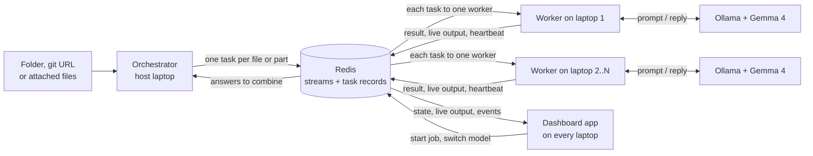

# LapClusters

> Turn the laptops your team already owns into one private AI cluster. Every laptop runs its own open model, a shared queue splits the work between them, and nothing is sent to a cloud service.

**Status:** working. Reviews, questions over mixed files, single prompts and code requests all run from the dashboard. It has been run across two physical laptops; a run across all four is still to do. What is not built is listed under [Key Features](#key-features) and [Known Limitations](#known-limitations).

## Team

**Team Name:** ReLUactivation


| Member            | Contribution                                                                 |
| ----------------- | ---------------------------------------------------------------------------- |
| Vishnu Vardhan N  | Team lead. Original idea, architecture and feature decisions, host laptop, testing, repository and submission |
| Niranjan          | Worked on llama.cpp support as an alternative to Ollama (not merged into this repository) |
| Nithin Krishnappa | Testing on his laptop; UI and design feedback                                |
| Dheeraj           | Second laptop in the multi-laptop tests; ideas and features                  |


## Problem Statement

### The Problem

Small teams and students want to use AI on their own code and documents, but cloud AI costs money per request and means sending private files to someone else's servers. A single laptop running a local model is private and free, but slow: working through a whole repository or a folder of documents one file at a time can take a very long time.

### Why We Chose This Problem

The Hack Day's track is open-source and open-weight AI, with a challenge for Gemma 4, so a model that runs on our own machines was the natural place to start. Trying it showed the catch straight away: one laptop is usable for a single question and far too slow for anything large.

A hackathon team is, physically, several capable laptops sitting on one network, most of them idle most of the time. The idea began as an orchestrator-and-worker design around Redis: one laptop hands out work, the others take it. If that could be made reliable on ordinary laptops and ordinary Wi-Fi, a team would get the speed of a bigger machine without paying for one and without its files leaving the room.

## Solution

LapClusters pools a team's laptops into one private cluster. Every laptop runs its own copy of Gemma 4 through Ollama, and a shared Redis queue hands out work. A job is split by a fixed rule into small tasks, each laptop takes a task when it is free, and the results are pieced back together. A dashboard on every laptop shows what each one is doing and lets you inspect every step.

### Key Features

Built:

- **Four kinds of job**
  - **Review code**: real defects in every source file of a folder or git repository, ranked by severity.
  - **Ask about files**: one question put to every file in a collection (code, documents, PDFs, pictures), with the per-file answers then pieced into one answer.
  - **Prompt**: a single question, answered by whichever laptop is free.
  - **Write code**: a request, answered with complete code.
- **A dashboard app on every laptop**: host a cluster or join one from a list, start and cancel jobs, attach files by button, drag and drop or paste, and watch each laptop's current task.
- **Transparency per task**: the model's reply streamed live, the result, the raw reply, the exact prompt, and a timeline of which laptop handled it and when.
- **No IP addresses**: laptops find the host on the local network by themselves and follow it if its address changes.
- **Interchangeable models**: each laptop reports the models it has installed, its owner or the host can switch between them, and every task records which model and laptop handled it.
- **Long files are split, not skipped**: into overlapping parts numbered as in the whole file, with a finding reported by two overlapping parts listed once.
- **Pictures stay with their text**: a document is sent together with the figures it refers to, a PDF with its page images, and a standalone picture with the passage that mentions it. Work with pictures goes only to laptops whose model can see.
- **Built for laptops that fail**
  - A laptop that drops out mid-task has its task taken over by another.
  - A laptop that cannot run its model (Ollama stopped, model not installed, out of memory) hands its task back to the queue and stops taking work until it is fixed, and its card says what is wrong.
  - A lost Redis connection is retried, a restarted Redis is recovered from, and failed tasks can be run again from the dashboard.
- **History and activity**: every job is kept with its time and the laptops that took part, and joins, departures, takeovers, hand-backs and model changes are recorded.
- **Everything also works from terminals**, without the dashboard.

Not built:

- Cross-checking a finding on a second laptop and model.
- Reading scanned PDFs, which have no text to extract.
- A one-click benchmark comparing one laptop against the full cluster. History shows the times of past jobs side by side.

## Innovation and Differentiation

Existing tools for pooling machines, such as exo, Petals and llama.cpp's RPC mode, split one large model across devices. LapClusters does the opposite: each laptop runs a complete small model, and the cluster distributes independent tasks between them. That keeps every laptop useful on its own, tolerates a laptop leaving mid-job, and needs nothing more than a network connection to Redis.

Work is split by a fixed rule (one task per file, or per part of a long file) and not by asking the model to plan, because small models are reliable at narrow tasks and unreliable at decomposing large ones.

The design assumes laptops are unreliable. A laptop problem is treated differently from a task failure: the task goes back to the queue for another laptop instead of being marked failed. We added this after one misconfigured laptop failed file after file within seconds during testing.

## Technical Implementation

### Architecture



### Technology Stack


| Category        | Technologies                                             |
| --------------- | -------------------------------------------------------- |
| Frontend        | Hand-written HTML, CSS and JavaScript, no build step     |
| Backend         | Python 3.11+, FastAPI, uvicorn, redis-py, httpx, python-dotenv, pypdf, Pillow |
| Database        | Redis 7 (Streams, consumer groups, hashes, sets, lists)  |
| AI / ML         | Gemma 4 E4B (`gemma4:e4b`) served locally by Ollama      |
| Infrastructure  | Docker (runs Redis), Git (clones repositories), pytest   |
| APIs / Services | Ollama local HTTP API. No cloud services                 |


### How It Works

- `lapclusters/taskqueue.py` is the only module that talks to Redis. Adding a task writes a status record (`task:{id}`), stores its data (`payload:{id}`), registers it under its job (`job:{id}`) and appends it to the `work` stream, all in one transaction. Tasks that include a picture go to a second stream, `work:vision`, which only laptops with a model that can see read from.
- `lapclusters/repo.py` turns a folder or git URL into tasks. A URL is cloned into a temporary folder on the host laptop, which is deleted once the files are read. Dependency folders are left out, long files are split into overlapping parts, PDFs have their text and pictures extracted, and pictures are shrunk and attached to the text that refers to them.
- `lapclusters/orchestrator.py` starts a job of any kind and, for a question over many files, queues the combining step once every file has been answered.
- `lapclusters/review.py` builds the review prompt (with numbered lines) and cleans up the model's JSON reply.
- `lapclusters/ask.py` holds the prompts for asking a question of one file and for piecing many answers into one. When the answers do not fit in a single request they are condensed in groups first, for as many rounds as it takes.
- `lapclusters/worker.py` runs a loop: claim one task through the `workers` consumer group, run it on the model, store the result, acknowledge the task. A background thread refreshes the worker's heartbeat every 3 seconds and carries out model changes sent by the host.
- `lapclusters/llm.py` makes the HTTP call to Ollama on the same laptop, streaming the reply so it can be shown while it is written.
- `lapclusters/discovery.py` and `lapclusters/host.py` let laptops find the host. The host answers a UDP broadcast question with its name and Redis port; the Redis password is never sent this way.
- `lapclusters/app/` is the dashboard. `server.py` is a local web server, `node.py` runs this laptop's worker and its host duties, `views.py` shapes what Redis holds for display, and `static/` is the page. The page asks its own laptop's server for the cluster state once a second.
- `lapclusters/cli.py` sends one prompt from a terminal and waits for the answer.
- `lapclusters/config.py` reads settings from environment variables or a `.env` file.

### Technical Decisions

- **Redis Streams with a consumer group** instead of a plain list, because the group guarantees one worker per task and keeps a record of tasks that were claimed but never finished.
- **Workers pull work when free.** Nothing assigns tasks up front, so a faster laptop naturally takes more.
- **Task content travels through Redis.** Workers need only a Redis connection, not a copy of the files or internet access.
- **A laptop problem is not a task failure.** When Ollama is down or a model is missing, the task goes back to the queue and the laptop pauses, so one misconfigured laptop cannot fail a whole job.
- **Takeover is based on heartbeats, not elapsed time.** A task is only taken from a worker whose heartbeat has expired, so a slow laptop that is still working is never interrupted.
- **The model's output is constrained to a JSON schema** for code review, through Ollama's structured output, because free-text replies from a small model are not reliably parseable.
- **Model context set to 32768 tokens.** Ollama's 4096 default is too small for source files. The host's value travels with each task so every laptop reads the same amount.
- **Each task's data is stored beside the queue, not in it**, so a task can be queued again (after a hand-back or a retry) without copying its file.
- **The queue is versioned.** A laptop running an older version reads an older queue and so receives nothing, instead of mishandling tasks it does not understand.
- **Each dashboard listens on its own laptop only.** Laptops never talk to each other's app; they share state through Redis. Requests that change anything must carry a header a web page on another site cannot send.

## Implementation During the Hackathon

Everything in this repository after the organisers' template commit was built on 8 October 2026, as the commit history shows. In the order it was built:

1. The Redis task queue, a worker that answers with Gemma 4, and a command-line tool to send a prompt.
2. Whole-repository code review: cloning, choosing files, one task per file, and a merged report.
3. Multi-laptop operation: heartbeats, takeover of a dead laptop's task, and automatic discovery of the host.
4. The dashboard app: connecting, live progress, per-task detail with streamed replies, results, history and activity.
5. Model inventory and switching, by the owner or by the host.
6. Questions over documents, PDFs and pictures with a combining step, single prompts and code requests.
7. Splitting long files, keeping pictures with their text, and routing picture work to laptops that can see.
8. Handing tasks back from a laptop that cannot run them, and running failed tasks again.
9. Attaching files in the browser, and a redesign of the landing page and cluster screens.

The project has 198 automated tests, which run against a real Redis.

Measured during the event, on an earlier version: reviewing eight source files took 180 and 135 seconds on one laptop (an RTX 4060 laptop GPU), and 121 and 89 seconds with a second laptop added. That is two runs of each on a small job, and identical runs varied by tens of seconds, so treat it as an indication and not a benchmark.

### Team Contributions

- **Vishnu Vardhan N:** Led the project. Proposed the orchestrator-and-worker cluster on Redis, decided the architecture and which features to build, ran the host laptop, directed the development and tested each feature as it was built, and maintained the repository.
- **Niranjan:** Worked on llama.cpp support, to run Gemma 4 through llama.cpp as an alternative to Ollama. That work is not part of this repository, which supports Ollama only.
- **Nithin Krishnappa:** Tested the project on his laptop, and gave the UI and design feedback that led to the redesign of the dashboard.
- **Dheeraj:** Ran the second laptop in the multi-laptop tests, including the network, password and model setup that those tests uncovered, and contributed ideas and features.

## Challenges and Learnings

- **Networks get in the way before code does.** Our first two-laptop test failed on the campus Wi-Fi and again behind Windows Firewall rules that blocked Docker. A phone hotspot worked. Typing an IP address that changed every time we switched network was unworkable, which is why the laptops now find each other.
- **One broken laptop can ruin a job.** A laptop whose model was not installed took file after file and failed each within a second. We learnt to separate "this task is bad" from "this laptop cannot work right now", and to send the task back in the second case.
- **Defaults hide failures.** The Redis client's default read timeout equalled our worker's waiting time, so an idle worker crashed after five seconds. Ollama's default context silently cut off the start of long prompts. Both looked fine in a quick test and failed in real use.
- **Small models need narrow jobs and a fixed output shape.** Asking for JSON in words was not reliable; constraining the reply to a schema was. The model still reports problems that are not real, so the dashboard shows every prompt and reply and the report says to treat findings as leads.
- **Mixed versions across laptops caused confusing failures**, so the queue is versioned and an out-of-date laptop is shown as needing an update.
- **Measure the hardware.** We guessed a safe context size until we measured: Gemma 4 E4B with a 32K context used about 5.1 GB on an 8 GB graphics card, fully on the GPU.

## Working Application

**Live Application:** N/A. LapClusters runs on your own laptops by design, so there is no hosted version.

See [Setup and Usage](#setup-and-usage) to run it locally.

## Demo Video

**Demo Video:** [Video URL]

## Open Source and AI Usage

### AI / Models

- **Gemma 4 E4B (Google, open weights):** the only model in the product. Every worker sends its task's prompt, and any pictures, to a local copy and stores the reply. No request leaves the laptop. Any other model installed in Ollama can be selected per laptop.

### Open Source Components

- **Ollama:** runs the model locally and exposes it over HTTP.
- **Redis:** task queue and state store.
- **FastAPI** and **uvicorn:** the dashboard's local web server.
- **redis-py:** Python client for Redis.
- **httpx:** HTTP client used to call Ollama.
- **pypdf:** extracts text and pictures from PDFs.
- **Pillow:** reads and shrinks pictures.
- **python-dotenv:** loads settings from a `.env` file.
- **pytest:** test runner.
- **Docker:** runs the Redis server.

No datasets or external APIs are used.

### AI Assistance in Development

Most of the code and tests in this repository were written with an AI coding assistant, Claude Code, working under the team's direction. The team chose the problem, proposed the architecture, decided what to build and in what order, ran the project on their own laptops, and found and reported the failures that shaped it.

## Setup and Usage

### Prerequisites

- Python 3.11 or newer
- Docker Desktop (to run Redis, on the host laptop only)
- Ollama with the `gemma4:e4b` model pulled

A step-by-step guide for teammates is in [docs/SETUP.md](docs/SETUP.md).

### Installation

```bash
git clone https://github.com/VishnuVardhanNk/LapCluster.git
cd LapCluster
python -m venv .venv
.venv\Scripts\Activate.ps1
python -m pip install -r requirements.txt
ollama pull gemma4:e4b
```

On macOS or Linux, activate the environment with `source .venv/bin/activate`.

On the host laptop, also start Redis with a password of your choice:

```bash
docker run -d --name redis -p 6379:6379 redis:7 redis-server --requirepass YOUR_PASSWORD
```

### Environment Variables

None are required when using the app. To change a default, copy `.env.example` to `.env`.

```env
REDIS_URL=redis://localhost:6379/0
CLUSTER_HOST=
OLLAMA_URL=http://localhost:11434
MODEL=gemma4:e4b
WORKER_NAME=
MODEL_TIMEOUT_S=600
MODEL_CONTEXT=32768
PART_CHARS=48000
```

`MODEL_CONTEXT` is how many tokens the model may read and write per request. The default of 32768 was measured to fit Gemma 4 E4B entirely on an 8 GB graphics card (an RTX 4060 laptop GPU, about 5.1 GB in use). The host's value is sent with every task, so the whole cluster uses the same. Lower it, together with `PART_CHARS`, if the laptops are weaker.

### Running the Project

Start the app. It opens in your browser at `http://127.0.0.1:8470`:

```bash
python -m lapclusters
```

On the first screen, enter the cluster password (the Redis password) and choose:

- **Host** on the laptop that runs Redis. It starts announcing the cluster and taking work.
- **Join** on every other laptop. Clusters found on the network are listed; pick one.

The host laptop's firewall must allow inbound TCP port 6379 (Redis) and UDP port 47600 (discovery). The app runs that laptop's worker itself, so no second terminal is needed, and it remembers its connection the next time it starts.

### Usage

- The **Laptops** column shows every laptop, the task it is on, and its model. Change your own laptop's model from its card; the host can change anyone's. A change applies from the laptop's next task.
- On the host, the **Work** tab starts a job: choose Review code, Ask about files, Prompt or Write code, fill in the folder or git URL and the question as needed, and start it. For Ask about files you can attach files instead: use the Attach files button, drop them onto the form, or paste a screenshot into the question box.
- Each task is a row. Click one to watch the model's reply as it is written, then see its result, the raw reply, the exact prompt and a timeline.
- **Results** shows a review's findings with filters, or a question's combined answer with what each file contributed. Both can be downloaded. **History** keeps each job's time and laptops for comparison. **Activity** records what happened in the cluster.

Two things to try are bundled:

- `tests/fixtures/sample_repo` is a tiny repository with bugs planted in it, for Review code.
- `examples/sales-pack` is a report that refers to a chart, the chart, a PDF memo and a photo of a sign. Asking it "How many units were sold in the month of the spring campaign, and what was the revenue that month?" can only be answered by reading the report and its chart together.

#### From a terminal

Everything also works without the app. On the host, announce the cluster and start a worker; on other laptops, set `REDIS_URL=redis://:PASSWORD@auto:6379/0` in `.env` and start a worker.

```bash
python -m lapclusters.host
python -m lapclusters.worker
```

Then, on the host:

```bash
python -m lapclusters.orchestrator tests/fixtures/sample_repo
python -m lapclusters.orchestrator examples/sales-pack --ask "What does each file say?"
python -m lapclusters.orchestrator --prompt "Explain what a task queue is in one sentence."
python -m lapclusters.orchestrator --code "A Python function that parses an ISO date"
```

`python -m lapclusters.discovery` lists the hosts visible from a laptop. If the network blocks broadcasts, put the host's IP address in place of `auto`.

#### Tests

Redis must be running. The tests use Redis database 15, so they never touch real tasks.

```bash
python -m pytest
```

### Known Limitations

- Run across two laptops so far, not yet four.
- Every laptop must run the same version. A laptop on an older version is shown as needing an update and is given no work.
- Automatic discovery needs a network that allows broadcasts between devices, such as a phone hotspot. Some campus and office networks do not.
- Automatic discovery trusts whoever answers. On a network you do not control, another device could pose as a host and receive the Redis password a laptop sends it, so use a fixed address or a private network such as Tailscale there.
- Each file, or part of a long file, is examined on its own, so a defect that spans two files or two distant parts of one file is not found.
- The model sometimes reports problems that are not real. Treat a review as leads to check.
- The final answer to a question is written by a small model from the per-file notes. It can blur a detail, so the notes it was written from are always shown beside it.
- Scanned PDFs have no text to extract and are listed as left out.
- A dead laptop's task is taken over by the next laptop that becomes free, so the handover can take as long as that laptop's current task.

## Devpost Submission

**Devpost Project:** [Devpost Project URL]

## Credits and License

### Credits

- Gemma 4 by Google.
- Ollama, Redis, FastAPI, uvicorn, redis-py, httpx, pypdf, Pillow, python-dotenv, pytest and Docker, each under its own licence.
- Claude Code by Anthropic, used as a coding assistant during development.
- Repository template by the Hacktoberfest Hack Day Coimbatore 2026 organisers (INIT Club and iDEA Club, with Major League Hacking).

### License

Apache License 2.0. See [LICENSE](LICENSE).

## Submission Checklist

- [x] Project title and description added
- [x] All team members listed
- [x] Problem clearly explained
- [x] Reason for choosing the problem explained
- [x] Solution and key features documented
- [x] Innovation and differentiation explained
- [x] Architecture included
- [x] Technical implementation documented
- [x] Work completed during the hackathon documented
- [x] Team contributions documented
- [x] Working application is functional
- [x] Live application link added where applicable
- [ ] Demo video added
- [x] AI and open-source components documented
- [ ] Setup and usage instructions tested
- [x] Challenges and learnings documented
- [ ] Devpost submission completed
- [ ] Devpost link added
- [x] Credits added
- [x] License added
- [x] Repository is organized and complete
