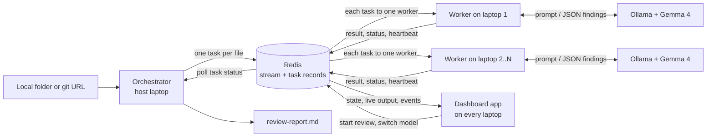

# LapClusters

> Turn the laptops your team already owns into a private AI cluster that reviews a whole code repository in parallel, with no cloud bill and no code leaving the room.

**Status:** the backend is built (checkpoints 1 to 3 of 5). A repository can be reviewed end to end, several laptops share the work, and a worker that dies mid-job has its task taken over. It has been run across two laptops on a phone hotspot. The dashboard app is built and has been exercised on one laptop, with a second copy joining it as a member; it has not yet been run on two separate laptops. Capability routing, cross-checking and a proper benchmark are still to come and are marked as planned below.

## Team

**Team Name:** [Team Name]


| Member | Contribution   |
| ------ | -------------- |
| [Name] | [Contribution] |
| [Name] | [Contribution] |
| [Name] | [Contribution] |
| [Name] | [Contribution] |


## Problem Statement

### The Problem

Small teams and students want to use AI on their own code, but cloud AI costs money per request and means sending private code to someone else's servers. A single laptop running a local model is private and free, but slow: reviewing a whole repository file by file can take a very long time.

### Why We Chose This Problem

[Explain why the team selected this problem and why solving it is important.]

## Solution

LapClusters pools a team's laptops into one private cluster. Every laptop runs its own copy of Gemma 4, and a shared Redis queue hands out work. For a code review, the orchestrator creates one task per file, the laptops review files in parallel, and the results are merged into a single report.

### Key Features

Built:

- A shared task queue on Redis Streams that delivers each task to exactly one worker.
- A worker that answers queued prompts with Gemma 4 running locally through Ollama.
- Per-task status tracking (`pending`, `running`, `done`, `failed`) with the result or error stored alongside.
- A worker that survives bad tasks, model errors and a dropped Redis connection.
- Whole-repository code review from a local folder or a git URL: one task per source file, merged into one Markdown report sorted by severity.
- Structured model output: Gemma 4 is constrained to a JSON schema, with one retry if a reply is still unusable.
- Worker heartbeats, and automatic takeover of a task whose worker has died. A task abandoned three times is marked failed so a job always finishes.
- Automatic host discovery on the local network: workers find the host without an IP address being typed, and follow it if its address changes.
- A command-line tool that submits a single prompt and waits for the answer.
- A dashboard app on every laptop: host or join from a list, start and cancel reviews, and watch each laptop's current file.
- Full transparency per file: the model's reply streamed live, the parsed findings, the raw reply, the exact prompt, and a timeline of what happened to it.
- Interchangeable models: each laptop reports the models it has installed, its owner or the host can switch between them, and every file records which model and laptop reviewed it.
- An activity feed and a history of jobs with their times and laptops, which the host can clear.
- Four kinds of job, not only code review:
  - **Review code**: defects in every source file.
  - **Ask about files**: one question put to every file in a folder (code, documents, PDFs, pictures), with the per-file answers then pieced into one answer.
  - **Prompt**: a single question, answered by whichever laptop is free.
  - **Write code**: a request, answered with complete code.
- Long files are split into overlapping parts instead of being skipped, each part numbered as in the whole file, and a finding reported by two overlapping parts is listed once.
- Pictures stay with their text: a document is sent together with the figures it refers to, a PDF with its page images, and a standalone picture with the passage that mentions it.
- Work with pictures goes only to laptops whose model can see. The dashboard says so when none is connected.
- A laptop that cannot run its model (Ollama stopped, model not installed, out of memory) hands its task back to the queue for another laptop and stops taking work until it is fixed, instead of failing file after file. Failed tasks can be run again from the dashboard.
- The app remembers its connection, so restarting it puts the laptop back in its cluster.

Planned:

- A run across all four laptops.
- Cross-checking high-severity findings on a second laptop and model.
- Reading scanned PDFs, which have no text to extract.
- A benchmark comparing one laptop against the full cluster.

## Innovation and Differentiation

Existing tools for pooling machines, such as exo, Petals and llama.cpp's RPC mode, split one large model across devices. LapClusters does the opposite: each laptop runs a complete small model, and the cluster distributes independent tasks between them. That keeps every laptop useful on its own, tolerates a laptop leaving mid-job, and needs nothing more than a network connection to Redis.

Work is split by a fixed rule (one task per file, or per part of a long file) and not by asking the model to plan, because small models are reliable at narrow tasks and unreliable at decomposing large ones.

## Technical Implementation

### Architecture



### Technology Stack


| Category        | Technologies                                             |
| --------------- | -------------------------------------------------------- |
| Frontend        | Hand-written HTML, CSS and JavaScript, no build step     |
| Backend         | Python 3.11+, FastAPI, uvicorn, redis-py, httpx, python-dotenv, pypdf, Pillow |
| Database        | Redis 7 (Streams, consumer groups, hashes, sets)         |
| AI / ML         | Gemma 4 E4B (`gemma4:e4b`) served locally by Ollama      |
| Infrastructure  | Docker (runs Redis), Git (clones repositories), pytest   |
| APIs / Services | Ollama local HTTP API. No cloud services                 |


If a category or technology is not implemented in the project, specify `N/A` instead of leaving the field blank.

### How It Works

- `lapclusters/taskqueue.py` is the only module that talks to Redis. Adding a task writes a status record (`task:{id}`), registers the task under its job (`job:{id}`) and appends it to the `tasks` stream, all in one transaction.
- `lapclusters/repo.py` turns a folder or git URL into tasks. A URL is cloned into a temporary folder on the host laptop, which is deleted once the files are read. Dependency folders are left out, long files are split into overlapping parts, PDFs have their text and pictures extracted, and pictures are shrunk and attached to the text that refers to them.
- `lapclusters/ask.py` holds the prompts for asking a question of one file and for piecing many answers into one. When the answers do not fit in a single request they are condensed in groups first, for as many rounds as it takes.
- `lapclusters/orchestrator.py` queues one review task per file, with the file's content inside the task, waits for all of them, and writes the report.
- `lapclusters/review.py` builds the review prompt (with numbered lines) and cleans up the model's JSON reply.
- `lapclusters/worker.py` runs a loop: claim one task through the `workers` consumer group, run it on the model, store the result, acknowledge the task. A background thread refreshes the worker's heartbeat every 5 seconds.
- `lapclusters/discovery.py` and `lapclusters/host.py` let workers find the host. The host answers a UDP broadcast question with its name and Redis port; the Redis password is never sent over the network this way.
- `lapclusters/app/` is the dashboard. `server.py` is a local web server, `node.py` runs this laptop's worker and its host duties, `views.py` shapes what Redis holds for display, and `static/` is the page. The page asks its own laptop's server for the cluster state once a second.
- `lapclusters/llm.py` makes the HTTP call to Ollama on the same laptop, streaming the reply so it can be shown while it is written.
- `lapclusters/cli.py` adds one plain-prompt task and polls its status record until it is `done` or `failed`.
- `lapclusters/config.py` reads the Redis address, Ollama address, model name and worker name from environment variables or a `.env` file.

### Technical Decisions

- **Redis Streams with a consumer group** instead of a plain list, because the group guarantees one worker per task and keeps a record of tasks that were claimed but never finished.
- **Workers pull work when free.** Nothing assigns tasks up front, so a faster laptop naturally takes more.
- **Task content travels through Redis.** Workers need only a Redis connection, not a copy of the repository or internet access.
- **Failures are recorded, not raised.** A model error or malformed task marks that task `failed` and the worker carries on.
- **Takeover is based on heartbeats, not elapsed time.** A task is only taken from a worker whose heartbeat has expired, so a slow laptop that is still working is never interrupted.
- **The model's output is constrained to a JSON schema** through Ollama's structured output, because free-text replies from a small model are not reliably parseable.
- **The Redis read timeout (60 s) is set above the worker's wait (5 s).** The client library's default timeout equals the wait, which made an idle worker crash.
- **Model context set to 32768 tokens**, because Ollama's 4096 default is too small for source files. The host's value travels with each task so every laptop reads the same amount.
- **A laptop problem is not a task failure.** When Ollama is down or a model is missing, the task goes back to the queue and the laptop pauses, so one misconfigured laptop cannot fail a whole job.
- **Each task's data is stored beside the queue, not in it**, so a task can be queued again (after a hand-back or a retry) without copying its file.
- **The queue is versioned.** A laptop running an older version reads an older queue and so receives nothing, instead of mishandling tasks it does not understand.

## Implementation During the Hackathon

[Describe what the team built during the Hack Day and the major functionality or components completed during the event.]

### Team Contributions

- **[Member Name]:** [Contribution]
- **[Member Name]:** [Contribution]
- **[Member Name]:** [Contribution]
- **[Member Name]:** [Contribution]

## Working Application

**Live Application:** N/A. LapClusters runs on your own laptops by design, so there is no hosted version.

See "Setup and Usage" below to run it locally.

The submitted application should be functional and accessible through the provided link where applicable.

## Demo Video

**Demo Video:** [Video URL]

[Provide a short demonstration of the working project, covering the main user flow and important functionality.]

## Open Source and AI Usage

### AI / Models

- **Gemma 4 E4B (Google, open weights):** the only model in the system. Every worker sends its task's prompt to a local copy and stores the reply. No request leaves the laptop.

### Open Source Components

- **Ollama:** runs Gemma 4 locally and exposes it over HTTP.
- **Redis:** task queue and status store.
- **redis-py:** Python client for Redis.
- **httpx:** HTTP client used to call Ollama.
- **python-dotenv:** loads settings from a `.env` file.
- **pytest:** test runner.
- **Docker:** runs the Redis server.

No datasets or external APIs are used.

## Setup and Usage

### Prerequisites

- Python 3.11 or newer
- Docker Desktop (to run Redis)
- Ollama with the `gemma4:e4b` model pulled

A fuller install guide for teammates is in [docs/SETUP.md](docs/SETUP.md).

### Installation

```bash
git clone https://github.com/VishnuVardhanNk/LapCluster.git
cd LapCluster
python -m venv .venv
.venv\Scripts\Activate.ps1
python -m pip install -r requirements.txt
docker run -d --name redis -p 6379:6379 redis:7
ollama pull gemma4:e4b
```

On macOS or Linux, activate the environment with `source .venv/bin/activate`.

### Environment Variables

Copy `.env.example` to `.env` and adjust if needed. Every value has a working default for a single laptop.

```env
REDIS_URL=redis://localhost:6379/0
OLLAMA_URL=http://localhost:11434
MODEL=gemma4:e4b
WORKER_NAME=
MODEL_TIMEOUT_S=600
MODEL_CONTEXT=32768
PART_CHARS=48000
```

`MODEL_CONTEXT` is how many tokens the model may read and write per request. The default of 32768 was measured to fit Gemma 4 E4B entirely on an 8 GB graphics card (an RTX 4060 laptop GPU, about 5.1 GB in use). The host's value is sent with every task, so the whole cluster uses the same. Lower it, together with `PART_CHARS`, if the laptops are weaker.

### Running the Project

Start the app. It opens in your browser:

```bash
python -m lapclusters
```

On the Connect screen, enter the cluster password (the Redis password) and choose:

- **Host** on the laptop that runs Redis. It starts announcing the cluster and reviewing files.
- **Join** on every other laptop. Hosts found on the network are listed; pick one.

The app runs that laptop's worker itself, so no second terminal is needed. From then on:

- The **Laptops** column shows every laptop, the file it is on, and its model. Change your own laptop's model from its card; the host can change anyone's. A change applies from the laptop's next file.
- On the host, the **Work** tab starts a job: choose Review code, Ask about files, Prompt or Write code, fill in the folder or git URL and the question as needed, and press Start. Each task is a row; click one to watch the model's reply as it is written, then see its result, the raw reply, the exact prompt and a timeline.
- **Results** shows a review's findings with filters, or a question's combined answer with what each file contributed. Both can be downloaded. **History** keeps each job's time and laptops for comparison. **Activity** records joins, departures, takeovers, hand-backs and model changes.

The app listens on `127.0.0.1` only. Laptops never talk to each other's app; they share state through Redis.

#### Without the app

Everything also works from terminals. Start a worker:

```bash
python -m lapclusters.worker
```

### Usage

In a second terminal, review a repository. The source can be a local folder or a git URL:

```bash
python -m lapclusters.orchestrator tests/fixtures/sample_repo
```

Progress is printed as files finish, and the report is written to `review-report.md` (change it with `--output`). The bundled sample repository contains deliberate bugs to try it on. The first request is slower because Ollama has to load the model.

The same command runs the other kinds of job:

```bash
python -m lapclusters.orchestrator docs --ask "What does each document recommend?"
python -m lapclusters.orchestrator --prompt "Explain what a task queue is in one sentence."
python -m lapclusters.orchestrator --code "A Python function that parses an ISO date"
```

### Adding More Laptops

One laptop is the host: it runs Redis and the orchestrator. Every laptop, including the host, runs a worker and its own Ollama.

1. On the host, start Redis with a password, and allow inbound TCP port 6379 and UDP port 47600 through its firewall.
2. On the host, run `python -m lapclusters.host` and leave it open. It announces the cluster on the local network.
3. On every other laptop, install the project and pull the model, then put this in `.env`: `REDIS_URL=redis://:PASSWORD@auto:6379/0`. The word `auto` tells the worker to find the host by itself.
4. Start `python -m lapclusters.worker` on each laptop. It prints the host address it found.
5. Run the orchestrator on the host. It prints how many workers are live.

Nobody types an IP address, and if the host's address changes a worker finds it again within a few seconds. `python -m lapclusters.discovery` lists the hosts visible from a laptop. If the network blocks broadcasts, put the host's IP address in place of `auto`.

If several hosts are on the same network, the worker lists them and asks which one to join, then stays with that host for the rest of the session. To skip the question, name the host in `.env` with `CLUSTER_HOST=`.

Only the host needs the repository and internet access. Step-by-step commands are in [docs/SETUP.md](docs/SETUP.md).

Run the tests (Redis must be running):

```bash
python -m pytest
```

To watch tasks move through Redis, and for what each teammate builds next, see [docs/TEAM_GUIDE.md](docs/TEAM_GUIDE.md).

### Known Limitations

- Run across two laptops so far, not yet four.
- Automatic discovery needs a network that allows broadcasts between devices, such as a phone hotspot. Some campus and office networks do not.
- Automatic discovery trusts whoever answers. On a network you do not control, another device could pose as a host and receive the Redis password a worker sends it, so use a fixed address or a private network such as Tailscale there.
- Each file, or part of a long file, is examined on its own, so a defect that spans two files or two distant parts of one file is not found.
- The final answer to a question is written by a small model from the per-file notes. It can blur a detail, so the notes it was written from are always shown beside it.
- Scanned PDFs have no text to extract and are listed as left out.
- Every laptop must run the same version. A laptop on an older version is shown as needing an update and is given no work.
- The model sometimes reports problems that are not real. Treat the report as leads to check.
- A dead worker's task is taken over by the next worker that becomes free, so the handover can take as long as that worker's current file.

## Devpost Submission

**Devpost Project:** [Devpost Project URL]

[Add the link to the team's Devpost submission. Ensure the Devpost project page is complete and contains the required project information, links, media, and team details.]

## Credits and License

### Credits

- Gemma 4 by Google.
- Ollama, Redis, redis-py, httpx, python-dotenv, pytest and Docker, each under its own licence.
- Repository template by the Hacktoberfest Hack Day Coimbatore 2026 organisers (INIT Club and iDEA Club, with Major League Hacking).

### License

Apache License 2.0 is intended. The `LICENSE` file has not been added yet.

## Submission Checklist

- [x] Project title and description added
- [ ] All team members listed
- [x] Problem clearly explained
- [ ] Reason for choosing the problem explained
- [x] Solution and key features documented
- [x] Innovation and differentiation explained
- [x] Architecture included
- [x] Technical implementation documented
- [ ] Work completed during the hackathon documented
- [ ] Team contributions documented
- [ ] Working application is functional
- [ ] Live application link added where applicable
- [ ] Demo video added
- [x] AI and open-source components documented
- [ ] Setup and usage instructions tested
- [ ] Challenges and learnings documented
- [ ] Devpost submission completed
- [ ] Devpost link added
- [x] Credits added
- [ ] License added
- [ ] Repository is organized and complete
